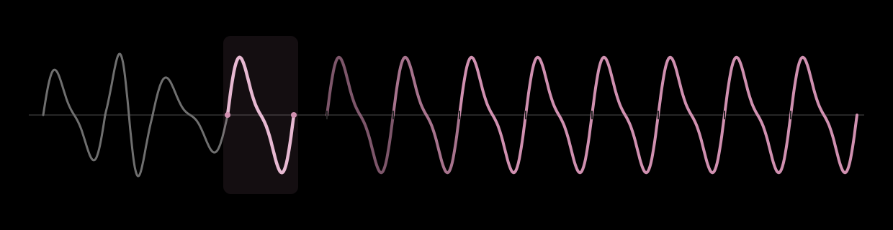

# WavesetUGens

SuperCollider server plugins (UGens) that port the waveset processes of the
[Composers Desktop Project](https://www.composersdesktop.com/) (CDP) to
buffer-reading UGens, in the spirit of `GrainBuf`.

A waveset is a span of signal between zero crossings. The source sound lives in
a Buffer rather than streaming, which lets the waveset processes emit sound more
fluently.

## UGens

Faithful ports of CDP's waveset DISTORT processes (parameters follow CDP
conventions; `rate` and `startPos` are SuperCollider extensions).

- **`WavesetRepeat`** (REPEAT) — replays each waveset `multiplier` times; time-stretches.
- **`WavesetMultiply`** (MULTIPLY) — raises wavecycle frequency by `multiplier`, duration preserved.
- **`WavesetInterpolate`** (INTERPOLATE) — morphs between consecutive wavesets (`multiplier`× stretch).
- **`WavesetOmit`** (OMIT) — silences `omit` of every `outOf` wavesets (timing preserved).
- **`WavesetDelete`** (DELETE) — keeps one wavecycle per `cyclecnt` group by `mode`; compresses.
- **`WavesetReverse`** (REVERSE) — plays each group of `cyclecnt` wavecycles backwards.
- **`WavesetReplace`** (REPLACE) — the loudest wavecycle in each `cyclecnt` group replaces the rest.
- **`WavesetShuffle`** (SHUFFLE) — reorders wavesets by a `domain`/`image` pattern (reorder/omit/duplicate).
- **`WavesetTelescope`** (TELESCOPE) — superimposes `cyclecnt` cycles into one (longest length); contracts.
- **`WavesetAverage`** (AVERAGE) — superimposes `cyclecnt` cycles into one mean-length cycle.
- **`WavesetFractal`** (FRACTAL) — adds a miniature of the whole `scale`-cycle group into each cycle.
- **`WavesetHarmonic`** (HARMONIC) — adds harmonics (`harmonics`/`amps`) over each cycle.
- **`WavesetPitch`** (PITCH) — wandering random transposition per cycle (`octvary`, seedable).
- **`WavesetDivide`** (DIVIDE) — divides wavecycle frequency by `divider`; dual of Multiply.

This covers the full CDP waveset DISTORT family.

## Install (prebuilt)

Download the archive for your OS from
[Releases](https://github.com/bjarnig/WavesetUGens/releases), extract the
`WavesetUGens/` folder into your SuperCollider Extensions folder, then recompile
the class library (Cmd/Ctrl-Shift-L) and reboot the server. Binaries target
SuperCollider 3.12–3.14.x (plugin API v3). On macOS, clear the download
quarantine: `xattr -dr com.apple.quarantine <extracted WavesetUGens folder>`.

## Build from source

```sh
./build.sh [path-to-supercollider-source]
```

Builds and installs into your user Extensions folder
(`.../SuperCollider/Extensions/WavesetUGens/`). Then in SuperCollider: recompile
the class library (Cmd-Shift-L) and boot the server.

```supercollider
b = Buffer.read(s, Platform.resourceDir +/+ "sounds/a11wlk01.wav"); // mono
{ WavesetRepeat.ar(b, repeats: 6) * 0.5 ! 2 }.play;
```

Requires CMake ≥ 3.12 and a C++17 compiler. Builds against a SuperCollider
source checkout matching the scsynth you run (see `build.sh`).

## Credits & license

Ports of CDP waveset processes by Trevor Wishart and the Composers Desktop
Project — an homage, not an official CDP product. Licensed under
**GPL-3.0** (see [`LICENSE`](LICENSE)).
